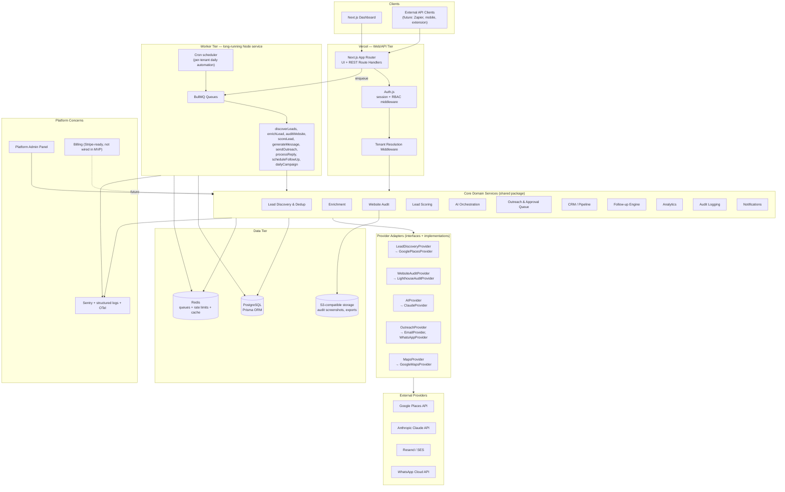
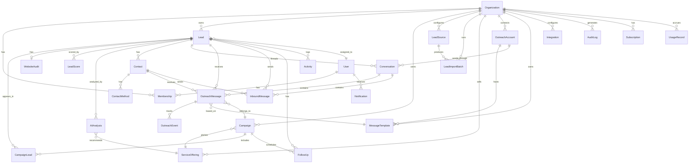
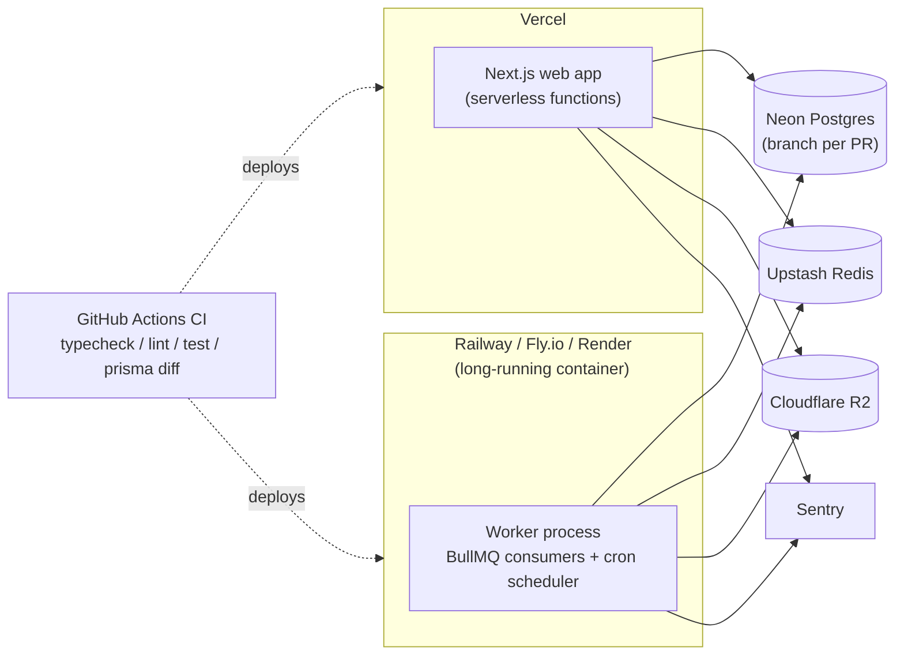

# Platform Architecture — AI Lead Generation & Outreach SaaS

**Status:** Proposed — awaiting sign-off before Phase 1 implementation begins.
**First tenant:** Virtelon (configured as data, not hard-coded).
**Scope of this document:** sections A–I as requested — architecture, folder structure, schema, core interfaces, roadmap, security, multi-tenancy, deployment, and dev order.

---

## 0. Assumptions made (stated, not asked)

A few calls had to be made to keep this moving instead of stalling on questions. All are reversible in code, not in data model shape:

1. **Auth provider:** Auth.js (NextAuth v5) with the Prisma adapter, JWT session strategy carrying `tenantId` + `role`. Mature, self-hosted (no third-party auth vendor lock-in), supports credentials + OAuth later.
2. **Postgres host:** Neon (serverless Postgres, branch-per-PR previews). Any managed Postgres works — this is a config choice, not an architectural one.
3. **Redis host:** Upstash (serverless-friendly, works from both Vercel functions and a long-running worker).
4. **Object storage:** Cloudflare R2 (S3-compatible, no egress fees — relevant once website-audit screenshots accumulate).
5. **Worker hosting is *not* Vercel.** Explained in §H — this is the one point worth flagging as a deliberate deviation from "Vercel where appropriate."
6. **Lead discovery v1 provider:** Google Places API (Text Search + Place Details) as the first `LeadDiscoveryProvider` implementation — it's an official, ToS-compliant, keyed API with the business attributes this product needs (name, category, rating, reviews, website, phone, address, geo). A second provider isn't built in Phase 2, but the interface is designed so one drops in without touching core logic.
7. **Outreach channel v1:** Email (via Resend or SES) as the first `OutreachProvider` implementation, because it requires no business-verification lead time. WhatsApp Business Platform (Meta Cloud API, official) is designed for from day one but implemented as the second provider once a WhatsApp Business Account is approved — this is an external dependency outside engineering control, not a technical blocker.
8. **AI provider v1:** Claude (Anthropic), as specified.

Everything else below follows directly from your spec.

---

## 0.1 Amendment Log — v2 (pre-Phase-1 product review)

You reviewed v1 and approved it with six amendments before implementation starts. This revision updates §B, §C, §D, and §E in place — nothing below was rebuilt from scratch. Summary of what changed and why:

1. **WhatsApp is now a first-class domain concept**, not just a future `OutreachProvider` implementation. Added `OutreachAccount` (connected sending identities), extended `MessageTemplate` with WhatsApp's template-approval lifecycle, added `Conversation` (threading + 24-hour session window), `InboundMessage`, `WebhookEvent` (signed, idempotent inbound event log), and phone normalization (`phoneE164`) across `Lead`/`Contact`. Email is still the first provider that actually sends in Phase 6 — this amendment is about the *model* being ready for WhatsApp on day one, not about building the Meta integration early.
2. **`Contact` is now a real one-to-many-to-many shape**: a `Lead` (business) has multiple `Contact`s (people), each with multiple `ContactMethod`s (phone/email/WhatsApp/social). Outreach and inbound messages carry an optional `contactId` alongside `leadId`, so history is queryable at either level.
3. **`LeadDiscoveryProvider` stays search-based**; a sibling `LeadImportAdapter` interface handles file/batch sources (CSV, manual entry, future API imports). Both funnel into one shared `ingestDiscoveredLeads()` pipeline, so dedup/normalize/persist logic never branches on where a lead came from.
4. **New `ServiceOffering` domain model** — structured services/offers a tenant sells, replacing the old free-text `Organization.services` blob as the thing AI and campaigns actually reason about. `Campaign.service` and `AIAnalysis.recommendedService` both gained structured FKs alongside their free-text fallbacks (backward-compatible for a tenant that hasn't configured offerings yet).
5. **`UsageRecord` tightened into a real metering primitive**: daily-bucketed upsert counters (`@@unique([organizationId, metric, periodStart])`) instead of an unbounded append-only log, plus a `packages/core/billing/metering.ts` module that's the single place every job/route increments usage and checks plan limits.
6. **Everything above is multi-tenant and provider-agnostic by construction** — every new model carries (or denormalizes) `organizationId`, and every new interface (`LeadImportAdapter`, extended `OutreachProvider`) follows the same swap-without-touching-core-logic rule as the originals.

---

## 0.2 Amendment Log — v3 (pre-Phase-3 broadened to "online presence research")

Phase 3 was originally scoped as "website audit + scoring" (§E). Many of the businesses this product targets (salons, coaching centers, small gyms) have no website at all — their entire online footprint is a Google Business Profile plus Instagram/Facebook. Scoping Phase 3 to websites only would miss most of them. Widened as follows, with the compliance boundary from §5/§10 held fixed:

1. **Google presence costs nothing new to add** — `rating`, `reviewCount`, and `businessStatus` are already captured on `Lead` during discovery (Phase 2). Phase 3's scoring step reads these directly; no new provider needed for this part.
2. **Website audit stays as designed** (`WebsiteAuditProvider`), implemented now as a real lightweight HTTP + HTML check (reachability, HTTPS, title/meta/viewport presence, response time) — not a claim of full Lighthouse-grade analysis, consistent with §7's "lightweight audit" instruction.
3. **New: social profile discovery, via two compliant paths only:**
   - When a lead has a website, its HTML is parsed for outbound links to instagram.com/facebook.com/linkedin.com/youtube.com/x.com — this is reading content the business already published on their own page, not scraping the social platforms themselves.
   - When a lead has no website (or the site doesn't link out), a new `SocialPresenceProvider` interface is queried — implemented against the official Google Custom Search JSON API (a paid/free-tier search API, not a scraper) to find publicly indexed profile URLs. Every result is tagged with a `confidence` ("high" | "low") and `source`, never silently presented as confirmed fact.
   - **What this deliberately does not do:** log into or scrape Instagram/Facebook/LinkedIn directly, bypass their access controls, or use unofficial/reverse-engineered endpoints. That line from §5/§10 does not move.
4. **No new database migration required** — results are stored in `Lead.socialProfiles` (already `Json?` in the schema), shaped as `{ [platform]: { url, confidence, source, checkedAt } }`.

---

## 0.3 Amendment Log — v4 (free-by-default lead discovery)

§0 originally assumed Google Places as the day-one discovery provider, with a mock fallback only for local dev before a key was provisioned. In practice, getting real leads flowing today without requiring a Google Cloud billing account (even one that stays within its free monthly credit) mattered more than the highest-fidelity data source. Changed:

1. **New `OpenStreetMapProvider`** implements `LeadDiscoveryProvider` — no code elsewhere changes, this is exactly the provider-swap the interface was designed for (§D). It geocodes the search location via Nominatim and finds businesses via Overpass, both official OpenStreetMap Foundation services — not a scraper of a third party, and not the business-listing platforms themselves.
2. **It is now the default** when `GOOGLE_PLACES_API_KEY` is unset, replacing the mock provider in that role. `MockLeadDiscoveryProvider` still exists and is still used directly in tests, but `getLeadDiscoveryProvider()` no longer returns it — a tenant with no configuration now gets real (if less complete) businesses instead of sample data by default.
3. **The tradeoff is stated plainly, in the product itself, not just this doc:** OSM has no star-rating/review-count concept at all (the scoring engine already treats a null rating as neutral rather than penalizing it — see `lead-scoring/scoring-engine.ts` — so this doesn't break scoring), phone numbers are missing on many listings, and category coverage is uneven — there is no dedicated OSM tag for several categories common in Indian small business (e.g. "coaching institute"), so those fall back to a name-text search rather than a precise tag match. The discovery form in the UI says this out loud when OpenStreetMap is the active provider, and disables the min-rating filter (since every result would otherwise show as unrated and be excluded).
4. **Compliance:** both Nominatim and Overpass are used within their documented usage policies — a descriptive `User-Agent` identifying the app, and call volume that stays well within "light use" (a handful of searches per campaign per day, not bulk/automated geocoding). If usage ever scales beyond that, self-hosting Overpass/Nominatim or switching the tenant to Google Places are the documented next steps — not scraping.
5. **No database migration required** — `DiscoveredLead.rating`/`reviewCount` were already optional.

---

## 0.4 Amendment Log — v5 (manual-send outreach queue)

§19/§A originally scoped Phase 6 outreach as an automated `OutreachProvider.send()` (Email via Resend/SES first, WhatsApp Business Platform second) — both require an external account with its own setup/approval lead time, and WhatsApp Cloud API specifically requires a Meta Business verification and, beyond the free tier, per-conversation billing. That's a real blocker to "workable today, free." Changed:

1. **No `OutreachProvider` implementation ships yet.** `OutreachMessage` (already modeled — see §0.1) is used exactly as designed for the approval workflow, but the terminal step is human, not a provider `send()` call: a rep opens an official WhatsApp **click-to-chat** link (`wa.me/<E164>?text=<encoded message>`) with the AI draft pre-filled, sends it themselves from their own WhatsApp, and clicks "Mark sent" to log it. This is a documented, ToS-compliant WhatsApp feature — not automation, not the unofficial WhatsApp Web scripting this project explicitly ruled out in §I.
2. **New `/outreach` queue page** lists every `OutreachMessage` in `PENDING_APPROVAL`/`QUEUED` org-wide. `outreach:approve` (MANAGER+) moves `PENDING_APPROVAL → QUEUED`; `outreach:send`, row-scoped the same way as `canModifyLead`, moves `QUEUED → SENT` once the rep confirms they actually sent it.
3. **`OutreachMessage.campaignId` is required by schema** but a lead discovered outside any campaign has none — `getOrCreateDefaultCampaign()` lazily creates one catch-all "Direct outreach" campaign per org the first time it's needed, rather than forcing campaign setup before a single message can be queued.
4. **When a real `OutreachProvider` is added later** (WhatsApp Business Platform once verified, or email), it slots in as an alternative terminal step — `QUEUED → SENDING → SENT` driven by a worker instead of a human click — without changing the approval model or the `OutreachMessage` schema.

---

## A. High-Level Architecture



**Read of the diagram:** the web tier never talks to external providers directly — it always goes through the same core service layer that the worker tier uses. That's the load-bearing decision: *one* set of business logic, invoked synchronously from API routes (for fast, user-facing operations like "regenerate this one message") and asynchronously from workers (for the daily bulk pipeline). No logic duplicated between "the API version" and "the job version."

---

## B. Complete Folder Structure

A **pnpm + Turborepo monorepo**. Reasoning in §H. This is not a single `create-next-app` — it's structured so the worker process and the web process can share the domain layer, database client, and types without copy-pasting.

```
virtelon-platform/
├── apps/
│   ├── web/                          # Next.js app (Vercel)
│   │   ├── app/
│   │   │   ├── (marketing)/          # public pages (future SaaS marketing site)
│   │   │   ├── (auth)/
│   │   │   │   ├── login/
│   │   │   │   ├── register/
│   │   │   │   └── accept-invite/
│   │   │   ├── (dashboard)/          # tenant-scoped, auth-gated
│   │   │   │   ├── dashboard/
│   │   │   │   ├── leads/
│   │   │   │   │   └── [id]/
│   │   │   │   ├── campaigns/
│   │   │   │   │   └── [id]/
│   │   │   │   ├── inbox/
│   │   │   │   ├── outreach/
│   │   │   │   ├── follow-ups/
│   │   │   │   ├── analytics/
│   │   │   │   ├── settings/
│   │   │   │   │   ├── organization/
│   │   │   │   │   ├── ai/
│   │   │   │   │   ├── offerings/       # ServiceOffering CRUD — what the tenant sells
│   │   │   │   │   ├── lead-sources/
│   │   │   │   │   ├── messaging/       # OutreachAccount connections + MessageTemplate approval status
│   │   │   │   │   ├── scoring-rules/
│   │   │   │   │   ├── follow-up-rules/
│   │   │   │   │   └── notifications/
│   │   │   │   ├── team/
│   │   │   │   └── integrations/
│   │   │   ├── admin/                 # platform-admin only, separate authz gate
│   │   │   │   ├── tenants/
│   │   │   │   ├── usage/
│   │   │   │   ├── system-health/
│   │   │   │   └── billing/
│   │   │   └── api/
│   │   │       └── v1/
│   │   │           ├── leads/
│   │   │           │   └── import/     # CSV/manual import upload → LeadImportBatch
│   │   │           ├── campaigns/
│   │   │           ├── outreach/
│   │   │           ├── crm/
│   │   │           ├── analytics/
│   │   │           ├── webhooks/       # inbound provider webhooks (signed, logged to WebhookEvent)
│   │   │           │   ├── whatsapp/
│   │   │           │   ├── email/
│   │   │           │   └── stripe/     # future
│   │   │           └── admin/
│   │   ├── components/
│   │   │   ├── ui/                    # primitives (button, card, table, badge…)
│   │   │   ├── leads/
│   │   │   ├── campaigns/
│   │   │   ├── outreach/
│   │   │   ├── analytics/
│   │   │   └── layout/
│   │   ├── lib/                       # web-app-only glue (session helpers, fetchers)
│   │   ├── middleware.ts              # tenant resolution + auth + security headers
│   │   └── next.config.ts
│   │
│   └── worker/                        # long-running Node process (Railway/Fly/Render)
│       ├── src/
│       │   ├── queues/                # BullMQ queue + worker definitions
│       │   ├── jobs/
│       │   │   ├── discoverLeads.job.ts
│       │   │   ├── importLeads.job.ts        # CSV/manual/API import batches
│       │   │   ├── enrichLead.job.ts
│       │   │   ├── auditWebsite.job.ts
│       │   │   ├── scoreLead.job.ts
│       │   │   ├── generateMessage.job.ts
│       │   │   ├── queueOutreach.job.ts
│       │   │   ├── sendOutreach.job.ts
│       │   │   ├── processInboundWebhook.job.ts  # WebhookEvent → InboundMessage/OutreachEvent, idempotent
│       │   │   ├── syncTemplateStatus.job.ts      # polls/reconciles WhatsApp template approval state
│       │   │   ├── processReply.job.ts
│       │   │   ├── scheduleFollowUp.job.ts
│       │   │   └── dailyCampaign.job.ts
│       │   ├── scheduler/             # cron-style per-tenant trigger
│       │   └── index.ts               # worker bootstrap + health server
│       └── package.json
│
├── packages/
│   ├── db/                            # Prisma schema + generated client + tenant-scoped client wrapper
│   │   ├── prisma/
│   │   │   ├── schema.prisma
│   │   │   └── migrations/
│   │   └── src/
│   │       ├── client.ts
│   │       └── tenant-scope.ts        # Prisma Client Extension enforcing tenantId
│   │
│   ├── core/                          # ALL business logic lives here — framework-agnostic
│   │   ├── lead-discovery/
│   │   │   ├── LeadDiscoveryProvider.ts     # interface — criteria-driven search
│   │   │   ├── LeadImportAdapter.ts         # interface — batch/file-based
│   │   │   ├── ingest.ts                    # shared funnel BOTH interfaces feed into
│   │   │   ├── providers/
│   │   │   │   ├── google-places.provider.ts
│   │   │   │   └── mock.provider.ts
│   │   │   ├── adapters/
│   │   │   │   ├── csv.adapter.ts
│   │   │   │   └── manual.adapter.ts
│   │   │   ├── dedup.ts
│   │   │   └── normalize.ts
│   │   ├── lead-enrichment/
│   │   ├── website-audit/
│   │   │   ├── WebsiteAuditProvider.ts
│   │   │   └── providers/
│   │   │       ├── lighthouse.provider.ts
│   │   │       └── mock.provider.ts
│   │   ├── lead-scoring/
│   │   │   ├── scoring-engine.ts
│   │   │   └── scoring-config.schema.ts
│   │   ├── ai/
│   │   │   ├── AIProvider.ts
│   │   │   ├── providers/
│   │   │   │   ├── claude.provider.ts
│   │   │   │   └── mock.provider.ts
│   │   │   ├── prompts/
│   │   │   └── schemas/                     # zod schemas for AI JSON output
│   │   ├── outreach/
│   │   │   ├── OutreachProvider.ts
│   │   │   ├── providers/
│   │   │   │   ├── email.provider.ts
│   │   │   │   ├── whatsapp.provider.ts
│   │   │   │   └── mock.provider.ts
│   │   │   ├── accounts.ts                  # OutreachAccount connect/disconnect/status sync
│   │   │   ├── templates.ts                 # MessageTemplate submit + approval-status sync
│   │   │   ├── conversations.ts             # Conversation threading, session-window tracking
│   │   │   ├── webhooks.ts                  # WebhookEvent verify → persist → dispatch
│   │   │   ├── approval-queue.ts
│   │   │   ├── limits.ts                    # daily/campaign limits, cooldowns
│   │   │   └── opt-out.ts
│   │   ├── offerings/                       # ServiceOffering CRUD + AIProvider projection
│   │   │   ├── service-offering.ts
│   │   │   └── to-ai-summary.ts
│   │   ├── crm/
│   │   ├── follow-up/
│   │   ├── analytics/
│   │   ├── integrations/
│   │   │   └── maps/
│   │   │       ├── MapsProvider.ts
│   │   │       └── providers/google-maps.provider.ts
│   │   ├── billing/
│   │   │   ├── metering.ts                  # recordUsage() / checkLimit() — the only place UsageRecord is written
│   │   │   └── plan-limits.ts               # interfaces only in MVP, no live billing provider
│   │   ├── notifications/
│   │   │   ├── NotificationProvider.ts
│   │   │   └── providers/
│   │   │       ├── in-app.provider.ts
│   │   │       ├── email.provider.ts
│   │   │       └── slack.provider.ts
│   │   ├── audit-log/
│   │   ├── lib/
│   │   │   └── phone.ts                     # normalizePhone() — the one place raw phone strings become E.164
│   │   └── rbac/
│   │       ├── roles.ts
│   │       └── permissions.ts
│   │
│   ├── types/                         # shared TS types + zod schemas (Lead, Campaign, etc.)
│   ├── config/                        # typed env loading (zod-validated), tenant defaults
│   └── ui-tokens/                     # design tokens shared by web (and future admin)
│
├── docs/
│   ├── ARCHITECTURE.md                # this file
│   └── api/                           # OpenAPI spec, generated
│
├── turbo.json
├── pnpm-workspace.yaml
└── package.json
```

**Why this split matters:** `packages/core` has zero dependency on Next.js or BullMQ. A job in `apps/worker` and a route handler in `apps/web` both call `packages/core/outreach/approval-queue.ts` — same function, same validation, same audit log write. This is what makes "REST API today, Chrome extension / Zapier / mobile client tomorrow" actually true, and it's what makes the provider-swap requirement (§35) real instead of aspirational.

---

## C. Database Schema / ERD

Core relationships (entities only — see full Prisma draft below for fields):



### Prisma schema (design draft — implemented in Phase 1)

```prisma
// packages/db/prisma/schema.prisma

generator client {
  provider = "prisma-client-js"
}

datasource db {
  provider = "postgresql"
  url      = env("DATABASE_URL")
}

// ─── Platform / Tenancy ─────────────────────────────────────

model Organization {
  id            String   @id @default(cuid())
  name          String
  slug          String   @unique
  plan          Plan     @default(FREE)
  branding      Json?    // logo url, colors, sender name — tenant config, never hard-coded
  services      Json?    // legacy free-text labels; superseded by ServiceOffering below
  timezone      String   @default("UTC")
  isActive      Boolean  @default(true)
  createdAt     DateTime @default(now())
  updatedAt     DateTime @updatedAt

  memberships       Membership[]
  leads             Lead[]
  campaigns         Campaign[]
  leadSources       LeadSource[]
  leadImportBatches LeadImportBatch[]
  serviceOfferings  ServiceOffering[]
  outreachAccounts  OutreachAccount[]
  messageTemplates  MessageTemplate[]
  conversations     Conversation[]
  inboundMessages   InboundMessage[]
  webhookEvents     WebhookEvent[]
  integrations      Integration[]
  auditLogs         AuditLog[]
  notifications     Notification[]
  subscription      Subscription?
  usageRecords      UsageRecord[]
  scoringConfig     ScoringConfig?
  outreachLimits    OutreachLimit?
  followUpRules     FollowUpRule[]
  blocklistEntries  BlocklistEntry[]

  @@index([slug])
}

enum Plan {
  FREE
  STARTER
  PROFESSIONAL
  AGENCY
  ENTERPRISE
}

model User {
  id            String   @id @default(cuid())
  email         String   @unique
  name          String?
  passwordHash  String?           // null if OAuth-only
  isPlatformAdmin Boolean @default(false)
  createdAt     DateTime @default(now())

  memberships       Membership[]
  assignedLeads     Lead[]            @relation("AssignedLeads")
  activities        Activity[]
  notifications     Notification[]
  auditLogs         AuditLog[]
}

model Membership {
  id             String   @id @default(cuid())
  organizationId String
  userId         String
  role           Role     @default(SALES)
  invitedAt      DateTime @default(now())
  joinedAt       DateTime?

  organization Organization @relation(fields: [organizationId], references: [id], onDelete: Cascade)
  user         User         @relation(fields: [userId], references: [id], onDelete: Cascade)

  @@unique([organizationId, userId])
  @@index([organizationId])
  @@index([userId])
}

enum Role {
  OWNER
  ADMIN
  MANAGER
  SALES
  VIEWER
}

// ─── Lead Sources, Discovery & Imports ───────────────────────
// LeadSource.type stays a free string ("google_places" | "csv_import" |
// "manual_entry" | "api_import" | …) deliberately, not a Prisma enum —
// a new discovery or import source must never require a schema migration.

model LeadSource {
  id             String   @id @default(cuid())
  organizationId String
  type           String
  config         Json     // provider-specific config, secrets referenced not embedded
  isActive       Boolean  @default(true)
  createdAt      DateTime @default(now())

  organization  Organization @relation(fields: [organizationId], references: [id], onDelete: Cascade)
  leads         Lead[]
  importBatches LeadImportBatch[]

  @@index([organizationId])
}

// One row per CSV/manual/API import run. Gives the UI something concrete to
// show ("18 of 20 rows imported, 2 duplicates skipped, 0 errors") and gives
// support a paper trail without touching the Lead table's hot path.
model LeadImportBatch {
  id              String   @id @default(cuid())
  organizationId  String
  sourceId        String
  fileName        String?
  status          ImportBatchStatus @default(PENDING)
  totalRows       Int      @default(0)
  importedCount   Int      @default(0)
  duplicateCount  Int      @default(0)
  errorCount      Int      @default(0)
  errors          Json?    // [{ row: 14, message: "missing phone or email" }]
  createdByUserId String?
  createdAt       DateTime @default(now())
  completedAt     DateTime?

  organization Organization @relation(fields: [organizationId], references: [id], onDelete: Cascade)
  source       LeadSource   @relation(fields: [sourceId], references: [id])

  @@index([organizationId, createdAt])
}

enum ImportBatchStatus {
  PENDING
  PROCESSING
  COMPLETED
  FAILED
}

model Lead {
  id               String   @id @default(cuid())
  organizationId   String

  businessName     String
  category         String
  subcategory      String?
  phone            String?
  phoneE164        String?  // normalized via packages/core/lib/phone — dedup + WhatsApp matching key
  email            String?
  website          String?
  address          String?
  city             String?
  state            String?
  country          String?
  latitude         Float?
  longitude        Float?
  rating           Float?
  reviewCount      Int?
  socialProfiles   Json?    // { instagram, facebook, linkedin, ... }
  businessStatus   String?  // OPERATIONAL | CLOSED_TEMPORARILY | CLOSED_PERMANENTLY | UNKNOWN

  sourceId         String              // LeadSource.id
  externalId       String?             // provider's stable id (e.g. Google Place ID) — dedup key
  dedupHash        String              // computed fallback hash (name+phone+geo) — dedup key

  status           LeadStatus @default(NEW)
  websiteStatus    WebsiteStatus @default(UNKNOWN)
  leadScore        Int?
  doNotContact     Boolean  @default(false)
  notes            String?

  discoveredAt     DateTime @default(now())
  lastEnrichedAt   DateTime?
  lastContactedAt  DateTime?
  assignedUserId   String?

  organization     Organization @relation(fields: [organizationId], references: [id], onDelete: Cascade)
  source           LeadSource   @relation(fields: [sourceId], references: [id])
  assignedUser     User?        @relation("AssignedLeads", fields: [assignedUserId], references: [id])

  contacts         Contact[]
  websiteAudit     WebsiteAudit?
  scores           LeadScore[]
  aiAnalyses       AIAnalysis[]
  campaignLeads    CampaignLead[]
  outreachMessages OutreachMessage[]
  inboundMessages  InboundMessage[]
  conversations    Conversation[]
  followUps        FollowUp[]
  activities       Activity[]

  @@unique([organizationId, externalId])
  @@index([organizationId, status])
  @@index([organizationId, dedupHash])
  @@index([organizationId, phoneE164])
  @@index([organizationId, category, city])
  @@index([organizationId, leadScore])
  @@index([organizationId, discoveredAt])
}

enum LeadStatus {
  NEW
  QUALIFIED
  CONTACTED
  REPLIED
  INTERESTED
  NOT_INTERESTED
  MEETING
  PROPOSAL
  WON
  LOST
  OPTED_OUT
  DO_NOT_CONTACT
}

enum WebsiteStatus {
  UNKNOWN
  MISSING
  PRESENT
  UNREACHABLE
}

// A Lead (business) can have several people; each Contact can be reachable
// through several methods (mobile, landline, email). ContactMethod is where
// normalized, verifiable, per-method data lives; Contact.email/phone stay as
// denormalized "primary method" copies so the common case skips a join.
model Contact {
  id        String   @id @default(cuid())
  leadId    String
  name      String?
  role      String?
  email     String?
  phone     String?
  phoneE164 String?
  isPrimary Boolean  @default(false)
  createdAt DateTime @default(now())

  lead             Lead              @relation(fields: [leadId], references: [id], onDelete: Cascade)
  methods          ContactMethod[]
  outreachMessages OutreachMessage[]
  inboundMessages  InboundMessage[]
  conversations    Conversation[]
  activities       Activity[]

  @@index([leadId])
}

model ContactMethod {
  id              String   @id @default(cuid())
  contactId       String
  type            ContactMethodType
  value           String              // raw, as entered/discovered
  normalizedValue String              // E.164 for phone/whatsapp, lowercased for email
  isPrimary       Boolean  @default(false)
  isVerified      Boolean  @default(false)
  createdAt       DateTime @default(now())

  contact Contact @relation(fields: [contactId], references: [id], onDelete: Cascade)

  @@unique([contactId, type, normalizedValue])
  @@index([contactId])
}

enum ContactMethodType {
  PHONE
  EMAIL
  WHATSAPP
  LINKEDIN
  INSTAGRAM
  FACEBOOK
  OTHER
}

// ─── Website Audit & Scoring ────────────────────────────────

model WebsiteAudit {
  id               String   @id @default(cuid())
  leadId           String   @unique
  url              String
  reachable        Boolean
  hasHttps         Boolean?
  score            Int?             // 0-100
  performanceHints Json?
  seoFindings      Json?
  strengths        String[]
  problems         String[]
  opportunities    String[]
  screenshotUrl    String?          // S3-compatible storage
  rawResult        Json?            // full provider payload for debugging
  auditedAt        DateTime @default(now())

  lead Lead @relation(fields: [leadId], references: [id], onDelete: Cascade)
}

model LeadScore {
  id             String   @id @default(cuid())
  leadId         String
  score          Int
  breakdown      Json     // { websiteOpportunity: 20, businessQuality: 15, ... }
  configVersion  Int      // which ScoringConfig version produced this
  computedAt     DateTime @default(now())

  lead Lead @relation(fields: [leadId], references: [id], onDelete: Cascade)

  @@index([leadId])
}

model ScoringConfig {
  id             String   @id @default(cuid())
  organizationId String   @unique
  weights        Json     // configurable weight per signal
  threshold      Int      @default(70)
  version        Int      @default(1)
  updatedAt      DateTime @updatedAt

  organization Organization @relation(fields: [organizationId], references: [id], onDelete: Cascade)
}

model AIAnalysis {
  id                  String   @id @default(cuid())
  leadId              String
  provider            String   // "claude"
  model               String
  score               Int?
  priority            String?  // low | medium | high
  reasoning           String[]
  painPoints          String[]
  opportunities       String[]
  recommendedServiceId String?          // structured pick from ServiceOffering, when it matches the catalog
  recommendedService  String?           // free-text fallback for a pitch outside the configured catalog
  recommendedPitch    String?
  rawResponse         Json
  validated           Boolean  @default(false)
  createdAt           DateTime @default(now())

  lead                Lead             @relation(fields: [leadId], references: [id], onDelete: Cascade)
  recommendedOffering ServiceOffering? @relation(fields: [recommendedServiceId], references: [id])

  @@index([leadId])
}

// ─── Services / Offerings (what the tenant sells) ────────────
// Structured so AIProvider.generateOutreach() can reason about which service
// to pitch and why, instead of matching against a single free-text blob.

model ServiceOffering {
  id                   String   @id @default(cuid())
  organizationId       String
  name                 String
  description          String
  targetIndustries     String[]
  targetBusinessTypes  String[]
  painPoints           String[]
  idealCustomerProfile String?
  priceRange           String?  // free text ("₹15,000–₹50,000" or "custom quote") — not all tenants price publicly
  pitchAngles          String[]
  caseStudies          Json?    // [{ title, summary, url }]
  portfolioUrls        String[]
  isActive             Boolean  @default(true)
  createdAt            DateTime @default(now())
  updatedAt            DateTime @updatedAt

  organization Organization @relation(fields: [organizationId], references: [id], onDelete: Cascade)
  campaigns    Campaign[]
  aiAnalyses   AIAnalysis[]

  @@index([organizationId, isActive])
}

// ─── Campaigns ───────────────────────────────────────────────

model Campaign {
  id                String   @id @default(cuid())
  organizationId    String
  name              String
  category          String
  location          String
  serviceId         String?           // structured link once the tenant has offerings configured
  serviceLabel      String            // free-text fallback, always present for display/back-compat
  dailyLeadTarget   Int      @default(20)
  minLeadScore      Int      @default(70)
  messageTone       String   @default("professional")
  language          String   @default("en")
  mode              CampaignMode @default(APPROVAL_REQUIRED)
  followUpRuleId    String?
  isActive          Boolean  @default(true)
  scheduleCron      String?  // e.g. "0 9 * * *"
  createdAt         DateTime @default(now())
  updatedAt         DateTime @updatedAt

  organization      Organization @relation(fields: [organizationId], references: [id], onDelete: Cascade)
  service           ServiceOffering? @relation(fields: [serviceId], references: [id])
  followUpRule      FollowUpRule? @relation(fields: [followUpRuleId], references: [id])
  campaignLeads     CampaignLead[]
  outreachMessages  OutreachMessage[]
  followUps         FollowUp[]

  @@index([organizationId, isActive])
}

enum CampaignMode {
  MANUAL
  APPROVAL_REQUIRED
  AUTOMATED
}

model CampaignLead {
  id         String   @id @default(cuid())
  campaignId String
  leadId     String
  addedAt    DateTime @default(now())

  campaign Campaign @relation(fields: [campaignId], references: [id], onDelete: Cascade)
  lead     Lead     @relation(fields: [leadId], references: [id], onDelete: Cascade)

  @@unique([campaignId, leadId])
  @@index([campaignId])
}

// ─── Outreach Accounts & Templates ───────────────────────────
// OutreachAccount is the connected sending identity (a WhatsApp Business
// phone number, a verified email domain). Channel-specific fields are kept
// first-class rather than buried in metadata JSON because they're queried
// and monitored directly — e.g. "show me every account with a RED quality
// rating" is a real dashboard query, not a debugging afterthought.

model OutreachAccount {
  id                  String   @id @default(cuid())
  organizationId      String
  channel             String   // "whatsapp" | "email" | "sms" — open string, new channels need no migration
  provider            String   // "whatsapp_cloud_api" | "resend" | "ses"
  label               String   // user-facing name, e.g. "Virtelon Sales WhatsApp"
  status              OutreachAccountStatus @default(PENDING_VERIFICATION)
  senderIdentity      String?  // E.164 phone for whatsapp/sms, verified from-address for email
  wabaId              String?  // WhatsApp Business Account id
  phoneNumberId       String?  // WhatsApp Cloud API phone number id
  qualityRating       WhatsAppQualityRating?
  encryptedCredentials String? // envelope-encrypted, never plaintext
  lastError           String?
  lastSyncedAt        DateTime?
  metadata            Json?
  createdAt           DateTime @default(now())
  updatedAt           DateTime @updatedAt

  organization     Organization @relation(fields: [organizationId], references: [id], onDelete: Cascade)
  templates        MessageTemplate[]
  conversations    Conversation[]
  outreachMessages OutreachMessage[]

  @@index([organizationId, channel])
}

enum OutreachAccountStatus {
  PENDING_VERIFICATION
  CONNECTED
  DISCONNECTED
  ERROR
}

enum WhatsAppQualityRating {
  GREEN
  YELLOW
  RED
  UNKNOWN
}

model MessageTemplate {
  id                 String   @id @default(cuid())
  organizationId     String
  outreachAccountId  String?  // required for whatsapp templates (tied to a WABA); null for freeform email
  name               String
  channel            String   // email | whatsapp
  category           String?  // whatsapp: MARKETING | UTILITY | AUTHENTICATION
  tone               String?
  language           String?
  bodyTemplate       String?  // static structure/fallback text
  components         Json?    // whatsapp: header/body/footer/button structured payload
  providerTemplateId String?  // id assigned by the channel provider once submitted
  approvalStatus     TemplateApprovalStatus @default(NOT_SUBMITTED)
  rejectionReason    String?
  submittedAt        DateTime?
  approvedAt         DateTime?
  isActive           Boolean  @default(true)
  createdAt          DateTime @default(now())
  updatedAt          DateTime @updatedAt

  organization    Organization @relation(fields: [organizationId], references: [id], onDelete: Cascade)
  outreachAccount OutreachAccount? @relation(fields: [outreachAccountId], references: [id])
  messages        OutreachMessage[]

  @@index([organizationId, channel])
}

enum TemplateApprovalStatus {
  NOT_SUBMITTED // email templates never leave this state — only whatsapp needs approval
  PENDING
  APPROVED
  REJECTED
  PAUSED
  DISABLED
}

// ─── Conversations & Messages ────────────────────────────────
// A Conversation threads a Lead/Contact + channel together so inbound and
// outbound messages render as one timeline in /inbox, and so WhatsApp's
// 24-hour customer-service-window rule (freeform replies only inside it,
// approved templates required outside it) has somewhere to be tracked.

model Conversation {
  id                    String   @id @default(cuid())
  organizationId        String
  leadId                String
  contactId             String?
  outreachAccountId     String
  channel               String
  status                ConversationStatus @default(OPEN)
  windowExpiresAt       DateTime?          // whatsapp 24h session window
  lastMessageAt         DateTime?
  lastMessageDirection  MessageDirection?
  createdAt             DateTime @default(now())

  organization     Organization    @relation(fields: [organizationId], references: [id], onDelete: Cascade)
  lead             Lead            @relation(fields: [leadId], references: [id], onDelete: Cascade)
  contact          Contact?        @relation(fields: [contactId], references: [id])
  outreachAccount  OutreachAccount @relation(fields: [outreachAccountId], references: [id])
  outreachMessages OutreachMessage[]
  inboundMessages  InboundMessage[]

  @@index([organizationId, status])
  @@index([leadId])
}

enum ConversationStatus {
  OPEN
  CLOSED
}

enum MessageDirection {
  INBOUND
  OUTBOUND
}

model OutreachMessage {
  id                String   @id @default(cuid())
  leadId            String
  contactId         String?
  campaignId        String
  conversationId    String?
  templateId        String?
  channel           String
  content           String
  generatedBy       String   // "ai" | "manual"
  status            OutreachStatus @default(DRAFT)
  scheduledFor      DateTime?
  approvedByUserId  String?
  approvedAt        DateTime?
  sentAt            DateTime?
  providerMessageId String?  // correlates with inbound webhook delivery/read/failed events
  outreachAccountId String?
  createdAt         DateTime @default(now())

  lead            Lead             @relation(fields: [leadId], references: [id], onDelete: Cascade)
  contact         Contact?         @relation(fields: [contactId], references: [id])
  campaign        Campaign         @relation(fields: [campaignId], references: [id], onDelete: Cascade)
  conversation    Conversation?    @relation(fields: [conversationId], references: [id])
  template        MessageTemplate? @relation(fields: [templateId], references: [id])
  outreachAccount OutreachAccount? @relation(fields: [outreachAccountId], references: [id])
  events          OutreachEvent[]

  @@index([leadId])
  @@index([contactId])
  @@index([campaignId, status])
  @@index([status, scheduledFor])
}

enum OutreachStatus {
  DRAFT
  PENDING_APPROVAL
  QUEUED
  SCHEDULED
  SENDING
  SENT
  DELIVERED
  FAILED
  REPLIED
  INTERESTED
  NOT_INTERESTED
  OPTED_OUT
  FOLLOW_UP_SCHEDULED
  CONVERTED
}

model OutreachEvent {
  id                   String   @id @default(cuid())
  messageId            String
  type                 String   // queued|sent|delivered|read|failed|replied|opted_out|template_status_changed
  providerErrorCode    String?
  providerErrorMessage String?
  metadata             Json?
  occurredAt           DateTime @default(now())

  message OutreachMessage @relation(fields: [messageId], references: [id], onDelete: Cascade)

  @@index([messageId])
}

// Raw inbound message from a lead/contact, across any channel. Kept separate
// from OutreachMessage (outbound-only: approval workflow, campaign
// attribution, AI generation) rather than unified into one direction-flagged
// model, since inbound messages have none of those outbound-only concerns.
model InboundMessage {
  id                String   @id @default(cuid())
  organizationId    String
  leadId            String
  contactId         String?
  conversationId    String
  outreachAccountId String   // denormalized copy of conversation.outreachAccountId, for fast filtering
  channel           String
  providerMessageId String
  fromIdentity      String   // phone or email the message came from
  content           String?
  messageType       String   @default("text") // text | image | document | button_reply | ...
  rawPayload        Json
  aiSummary         String?  // optional AI intent/summary — never fabricated, omitted if not confident
  receivedAt        DateTime @default(now())
  processedAt       DateTime?

  organization Organization @relation(fields: [organizationId], references: [id], onDelete: Cascade)
  lead         Lead         @relation(fields: [leadId], references: [id], onDelete: Cascade)
  contact      Contact?     @relation(fields: [contactId], references: [id])
  conversation Conversation @relation(fields: [conversationId], references: [id], onDelete: Cascade)

  @@unique([outreachAccountId, providerMessageId])
  @@index([organizationId, receivedAt])
  @@index([conversationId])
}

// Every inbound webhook call lands here first — raw, signature-checked, and
// idempotency-keyed on the provider's own event id — before anything derived
// from it (OutreachEvent, InboundMessage, template status) is written. This
// is what makes webhook processing replay-safe if a job retries.
model WebhookEvent {
  id                String   @id @default(cuid())
  organizationId    String?  // nullable: some payloads arrive before the account can be resolved
  provider          String   // "whatsapp_cloud_api" | "resend" | ...
  externalEventId   String   // provider's event/message id — the idempotency key
  eventType         String
  payload           Json
  signatureValid    Boolean
  processedAt       DateTime?
  processingError   String?
  receivedAt        DateTime @default(now())

  organization Organization? @relation(fields: [organizationId], references: [id], onDelete: Cascade)

  @@unique([provider, externalEventId])
  @@index([organizationId, receivedAt])
}

model OutreachLimit {
  id                  String @id @default(cuid())
  organizationId      String @unique
  dailyLimit          Int    @default(20)
  perCampaignLimit    Int?
  cooldownMinutes     Int    @default(0)

  organization Organization @relation(fields: [organizationId], references: [id], onDelete: Cascade)
}

model BlocklistEntry {
  id             String   @id @default(cuid())
  organizationId String
  contactKey     String   // email or phone, normalized — the authoritative suppression key
  channel        String   @default("all") // "all" | "whatsapp" | "email" — not nullable: Postgres treats NULL as distinct in unique constraints, which would silently defeat this one
  reason         String?  // opted_out | manual_block
  createdAt      DateTime @default(now())

  organization Organization @relation(fields: [organizationId], references: [id], onDelete: Cascade)

  @@unique([organizationId, contactKey, channel])
  @@index([organizationId])
}

// ─── Follow-ups ──────────────────────────────────────────────

model FollowUpRule {
  id             String   @id @default(cuid())
  organizationId String
  name           String
  steps          Json     // [{ dayOffset: 3, tone: "friendly" }, { dayOffset: 7, tone: "final" }]
  stopOnReply    Boolean  @default(true)
  stopOnOptOut   Boolean  @default(true)
  createdAt      DateTime @default(now())

  organization Organization @relation(fields: [organizationId], references: [id], onDelete: Cascade)
  campaigns    Campaign[]
}

model FollowUp {
  id         String   @id @default(cuid())
  leadId     String
  campaignId String
  stepIndex  Int
  scheduledFor DateTime
  status     String   @default("scheduled") // scheduled|sent|cancelled
  createdAt  DateTime @default(now())

  lead     Lead     @relation(fields: [leadId], references: [id], onDelete: Cascade)
  campaign Campaign @relation(fields: [campaignId], references: [id], onDelete: Cascade)

  @@index([leadId])
  @@index([status, scheduledFor])
}

// ─── CRM / Activity ──────────────────────────────────────────

model Activity {
  id        String   @id @default(cuid())
  leadId    String
  contactId String?  // set when the activity concerns a specific person, not just the business
  userId    String?
  type      String   // note|status_change|assignment|call|meeting
  content   String?
  metadata  Json?
  createdAt DateTime @default(now())

  lead    Lead     @relation(fields: [leadId], references: [id], onDelete: Cascade)
  contact Contact? @relation(fields: [contactId], references: [id])
  user    User?    @relation(fields: [userId], references: [id])

  @@index([leadId])
}

// ─── Integrations / Billing-ready / Usage ───────────────────

model Integration {
  id             String   @id @default(cuid())
  organizationId String
  type           String   // "whatsapp_cloud_api" | "resend" | "google_places" | "stripe"
  status         String   @default("disconnected") // connected|disconnected|error
  encryptedCredentials String? // envelope-encrypted, never plaintext
  metadata       Json?
  createdAt      DateTime @default(now())
  updatedAt      DateTime @updatedAt

  organization Organization @relation(fields: [organizationId], references: [id], onDelete: Cascade)

  @@unique([organizationId, type])
}

model Subscription {
  id             String   @id @default(cuid())
  organizationId String   @unique
  plan           Plan     @default(FREE)
  status         String   @default("active") // active|past_due|canceled
  externalRef    String?  // future Stripe subscription id
  currentPeriodEnd DateTime?

  organization Organization @relation(fields: [organizationId], references: [id], onDelete: Cascade)
}

// One row per (org, metric, day) — a counter, upserted-and-incremented by
// packages/core/billing/metering.ts, not an append-only event log. Daily
// granularity matches the daily-limit enforcement need; monthly/plan-period
// totals are a SUM over rows, computed on read.
model UsageRecord {
  id             String   @id @default(cuid())
  organizationId String
  metric         String   // see packages/core/billing/metering.ts for the closed set of meterable metrics
  quantity       Int      @default(0)
  periodStart    DateTime // truncated to the start of the day
  periodEnd      DateTime

  organization Organization @relation(fields: [organizationId], references: [id], onDelete: Cascade)

  @@unique([organizationId, metric, periodStart])
  @@index([organizationId, metric, periodStart])
}

// ─── Audit & Notifications ───────────────────────────────────

model AuditLog {
  id             String   @id @default(cuid())
  organizationId String
  userId         String?
  action         String   // "campaign.created" | "message.approved" | ...
  entityType     String
  entityId       String
  metadata       Json?
  createdAt      DateTime @default(now())

  organization Organization @relation(fields: [organizationId], references: [id], onDelete: Cascade)
  user         User?        @relation(fields: [userId], references: [id])

  @@index([organizationId, createdAt])
  @@index([organizationId, entityType, entityId])
}

model Notification {
  id             String   @id @default(cuid())
  organizationId String
  userId         String?
  type           String
  title          String
  body           String?
  readAt         DateTime?
  createdAt      DateTime @default(now())

  organization Organization @relation(fields: [organizationId], references: [id], onDelete: Cascade)
  user         User?        @relation(fields: [userId], references: [id])

  @@index([organizationId, userId, readAt])
}
```

**Indexing notes:**
- Every tenant-scoped table leads with an `organizationId`-prefixed composite index matching its dominant query pattern (status filtering, category+city search, score sorting, time-series analytics).
- `Lead` dedup uses **two** keys: `externalId` (provider's stable ID — exact dedup) and `dedupHash` (normalized name+phone+geo fallback — catches leads from different sources describing the same real business). Both are unique/indexed per organization, never globally, so two tenants can legitimately have "the same" business as separate leads.
- `OutreachMessage.status` + `scheduledFor` composite index is what the queue worker scans to find due jobs — this is the hottest query in the system once outreach volume grows.
- `phoneE164` is indexed on both `Lead` and used (via `ContactMethod.normalizedValue`) for `Contact` — it's the join key inbound WhatsApp webhooks use to resolve "which lead/contact just messaged us" from a raw phone number.
- `InboundMessage` and `WebhookEvent` are both idempotency-keyed on `(providerAccount/provider, providerEventId)` — a retried webhook delivery is a no-op, not a duplicate row.
- `UsageRecord`'s `@@unique([organizationId, metric, periodStart])` is what turns metering into a safe `upsert`-and-increment instead of a table that grows one row per discovered lead forever.

---

## D. Core Interfaces

These are the seams the entire "no vendor lock-in" requirement depends on. Every one lives in `packages/core/**/*.ts` with zero framework dependency, so they're unit-testable in isolation and swappable without touching route handlers or job definitions.

```typescript
// packages/core/lead-discovery/LeadDiscoveryProvider.ts

export interface LeadSearchCriteria {
  category: string;
  location: string;             // free-text, resolved to geo by the provider
  minRating?: number;
  maxRating?: number;
  requireWebsite?: boolean;
  limit: number;
}

export interface DiscoveredLead {
  externalId: string;           // provider's stable identifier
  source: string;                // provider name, e.g. "google_places"
  businessName: string;
  category: string;
  phone?: string;
  website?: string;
  address?: string;
  city?: string;
  state?: string;
  country?: string;
  latitude?: number;
  longitude?: number;
  rating?: number;
  reviewCount?: number;
  businessStatus?: string;
  raw: Record<string, unknown>;  // original provider payload, retained for debugging/audit
}

export interface LeadDiscoveryProvider {
  readonly name: string;
  search(criteria: LeadSearchCriteria): Promise<DiscoveredLead[]>;
}
```

```typescript
// packages/core/lead-discovery/LeadImportAdapter.ts
//
// Batch/file-based sources (CSV upload, manual entry, future API imports)
// don't fit a criteria-driven search() call, so they get a sibling interface
// instead of being forced through LeadDiscoveryProvider. Both interfaces
// produce the SAME DiscoveredLead[] shape and both feed the SAME ingestion
// pipeline below — that's what keeps core dedup/normalize/persist logic from
// ever having to branch on where a lead came from.

export interface ImportInput {
  organizationId: string;
  sourceId: string;
  file?: { buffer: Buffer; filename: string; mimeType: string };
  rows?: Record<string, string>[];         // e.g. rows already parsed from a manual-entry form
  columnMapping?: Record<string, string>;  // user-confirmed CSV column → DiscoveredLead field
}

export interface ImportRowError {
  row: number;
  message: string;
}

export interface LeadImportAdapter {
  readonly name: string;
  parse(input: ImportInput): Promise<{ leads: DiscoveredLead[]; errors: ImportRowError[] }>;
}
```

```typescript
// packages/core/lead-discovery/ingest.ts
//
// The single funnel every discovery/import path calls. This — not the
// provider interfaces themselves — is the actual enforcement point for
// "provider-agnostic core logic": a new LeadDiscoveryProvider or
// LeadImportAdapter only ever needs to produce DiscoveredLead[] correctly;
// everything downstream (dedup, normalize, persist, LeadSource attribution,
// usage metering) is written exactly once, here.

export interface IngestResult {
  createdCount: number;
  duplicateCount: number;
  updatedCount: number;
  leadIds: string[];
}

export async function ingestDiscoveredLeads(
  ctx: { organizationId: string; sourceId: string },
  leads: DiscoveredLead[]
): Promise<IngestResult>;
```

```typescript
// packages/core/website-audit/WebsiteAuditProvider.ts

export interface WebsiteAuditResult {
  url: string;
  reachable: boolean;
  hasHttps?: boolean;
  score: number | null;          // 0-100, null if not reachable
  strengths: string[];
  problems: string[];
  opportunities: string[];
  performanceHints?: Record<string, unknown>;
  seoFindings?: Record<string, unknown>;
  screenshotUrl?: string;
}

export interface WebsiteAuditProvider {
  readonly name: string;
  audit(url: string): Promise<WebsiteAuditResult>;
}
```

```typescript
// packages/core/ai/AIProvider.ts

import { z } from "zod";

export const LeadAnalysisSchema = z.object({
  score: z.number().min(0).max(100),
  priority: z.enum(["low", "medium", "high"]),
  reasoning: z.array(z.string()),
  painPoints: z.array(z.string()),
  opportunities: z.array(z.string()),
  recommendedServiceId: z.string().nullable(),  // must be one of the ServiceOffering ids passed in tenantServices, or null
  recommendedService: z.string().nullable(),     // free-text fallback when nothing in the catalog fits
  recommendedPitchAngle: z.string().nullable(),
});
export type LeadAnalysis = z.infer<typeof LeadAnalysisSchema>;

// Slim projection of ServiceOffering — the AI provider gets exactly the
// fields it needs to reason about fit, not the full CRM-facing record
// (price range, portfolio URLs, etc. stay out of the prompt).
export interface ServiceOfferingSummary {
  id: string;
  name: string;
  description: string;
  targetIndustries: string[];
  painPoints: string[];
  pitchAngles: string[];
}

export interface OutreachGenerationInput {
  lead: {
    businessName: string;
    category: string;
    city?: string;
    website?: string | null;
    websiteAudited: boolean;       // gate: AI may only reference audit facts if this is true
  };
  websiteAudit?: WebsiteAuditResult | null;
  analysis?: LeadAnalysis | null;
  tenantServices: ServiceOfferingSummary[];  // tenant's own structured catalog — never hard-coded, never a bare string
  tone: "formal" | "friendly" | "concise" | "professional" | "hinglish";
  language: "en" | "hi" | "hinglish";
  campaignObjective: string;
}

export interface AIProvider {
  readonly name: string;
  analyzeLead(input: OutreachGenerationInput): Promise<LeadAnalysis>;
  generateOutreach(input: OutreachGenerationInput): Promise<string>;
  generateFollowUp(input: OutreachGenerationInput & { previousMessage: string; stepIndex: number }): Promise<string>;
  summarizeConversation(messages: string[]): Promise<string>;
}
```

```typescript
// packages/core/outreach/OutreachProvider.ts

export interface OutreachSendInput {
  accountId: string;                // OutreachAccount to send through
  to: { email?: string; phone?: string };
  subject?: string;                 // email only
  body?: string;                    // freeform — email always; whatsapp only inside the 24h session window
  template?: {                      // required for whatsapp sends outside the session window
    providerTemplateId: string;
    language: string;
    params: Record<string, string>;
  };
  metadata?: Record<string, unknown>;
}

export interface OutreachSendResult {
  providerMessageId: string;
  status: "sent" | "queued" | "failed";
  errorCode?: string;
  errorMessage?: string;
}

// Channel-provider-specific, called from account-connection and template
// settings flows rather than the send path — kept on the same interface so
// a WhatsApp implementation owns its whole lifecycle (connect → submit
// template → send) behind one seam.
export interface TemplateSubmissionInput {
  accountId: string;
  name: string;
  category: "MARKETING" | "UTILITY" | "AUTHENTICATION";
  language: string;
  components: Record<string, unknown>;
}

export interface OutreachProvider {
  readonly name: string;
  readonly channel: "email" | "whatsapp" | "sms";
  /**
   * Implementations MUST reject a freeform `body` send outside a channel's
   * session window (e.g. WhatsApp's 24-hour rule) rather than silently
   * sending — enforced by the provider, not assumed by the caller.
   */
  send(input: OutreachSendInput): Promise<OutreachSendResult>;
  /** No-op for channels without a template-approval concept (e.g. email). */
  submitTemplate?(input: TemplateSubmissionInput): Promise<{ providerTemplateId: string }>;
  /** Verifies inbound webhook signatures before events are trusted. */
  verifyWebhookSignature(rawBody: string, headers: Record<string, string>): boolean;
}
```

```typescript
// packages/core/integrations/maps/MapsProvider.ts

export interface MapsProvider {
  readonly name: string;
  geocode(address: string): Promise<{ lat: number; lng: number } | null>;
  placeDetails(externalId: string): Promise<Record<string, unknown> | null>;
}
```

```typescript
// packages/core/notifications/NotificationProvider.ts

export interface NotificationPayload {
  organizationId: string;
  userId?: string;
  type: string;
  title: string;
  body?: string;
}

export interface NotificationProvider {
  readonly channel: "in_app" | "email" | "slack" | "whatsapp";
  send(payload: NotificationPayload): Promise<void>;
}
```

**Design rule these interfaces enforce:** an `AIProvider.generateOutreach()` implementation is *structurally prevented* from claiming a website was audited when `websiteAudited: false` — that flag is a required input, not something the prompt author has to remember to check. This is the mechanism behind §9's "must not fabricate facts" requirement — enforced in the type, not just the prompt wording. The same pattern now covers service recommendations: `tenantServices` is a typed catalog, not a free string, so `recommendedServiceId` in the AI's output is checkable against real IDs rather than trusted at face value.

Two small supporting pieces that aren't providers but are shared everywhere providers touch a phone number:

```typescript
// packages/core/lib/phone.ts
export function normalizePhone(raw: string, defaultCountry?: string): string | null; // → E.164 or null if unparseable
```

Every entry point that accepts a phone number — lead discovery normalization, contact creation, CSV import, inbound WhatsApp webhook matching — calls this once. It's what makes `Lead.phoneE164` / `ContactMethod.normalizedValue` reliable dedup and matching keys instead of best-effort string comparisons.

```typescript
// packages/core/billing/metering.ts
export type MeterableMetric =
  | "leads_discovered" | "enrichment_operations" | "website_audits"
  | "ai_generations" | "ai_tokens" | "messages_sent";

export async function recordUsage(organizationId: string, metric: MeterableMetric, quantity: number): Promise<void>;
export async function checkLimit(organizationId: string, metric: MeterableMetric): Promise<{ allowed: boolean; used: number; limit: number }>;
```

Every job or route that performs a meterable action calls `recordUsage()`; anything that's about to enqueue one calls `checkLimit()` first. Team-member and active-campaign counts are *not* metered here — those are current-state gauges derived with a `COUNT(*)` against `Membership`/`Campaign` at read time, not events to log.

---

## E. MVP Roadmap

Each phase ends in a working, demoable state — not a stub.

| Phase | Deliverable | Exit criteria |
|---|---|---|
| **1. Foundation** | Monorepo, full Prisma schema (incl. WhatsApp/Contact/Offering/metering models) + migrations, Auth.js login/register, Organization+Membership+Role model, tenant-resolution middleware, RBAC guard, empty dashboard shell | A user can register, create an org, invite a teammate with a role, and see a role-gated empty dashboard. Tenant isolation has a passing test suite. |
| **2. Lead Discovery** | `LeadDiscoveryProvider` + `GooglePlacesProvider` + `MockProvider`, `LeadImportAdapter` + `CsvImportAdapter`, shared `ingestDiscoveredLeads()`, dedup engine, Lead CRUD + list/filter UI, `/leads/import` | Running a search by category+location *and* uploading a CSV both land in `/leads` through the same dedup pipeline, with an `LeadImportBatch` showing import results. |
| **3. Audit + Scoring** | `WebsiteAuditProvider` + Lighthouse-based implementation, `ScoringConfig` + scoring engine, lead score visible on lead detail | Leads with a website get a 0–100 score with strengths/problems/opportunities; leads without one are flagged `MISSING` and scored accordingly. |
| **4. AI Personalization** | `AIProvider` + `ClaudeProvider`, `ServiceOffering` CRUD (`/settings/offerings`), `analyzeLead()` + `generateOutreach()` consuming the tenant's structured offering catalog, zod-validated output, `AIAnalysis` persisted | Lead detail page shows AI analysis + a generated draft message that cites a specific configured service (or a labeled free-text fallback), grounded only in verified data. |
| **5. Campaigns + CRM** | Campaign CRUD (with `ServiceOffering` link), `CampaignLead`, pipeline stages, `Contact`/`ContactMethod` UI on lead detail, Activity timeline at lead *and* contact level, assignment | A campaign can be created against a real service offering, leads attached, moved through the CRM pipeline, with contact-level activity visible. |
| **6. Outreach + Approval** | `OutreachProvider` + `EmailProvider` (live) + `WhatsAppProvider` (built against the Cloud API, activated once a WABA is approved), `OutreachAccount` connection flow, `MessageTemplate` submission + approval-status sync, `Conversation`/`InboundMessage` + signed `WebhookEvent` handling, approval queue UI, opt-out/blocklist enforcement | A generated message can be reviewed, edited, approved, and sent through email; the WhatsApp path is fully wired and testable against a sandbox WABA even before Virtelon's production number is approved. Opted-out contacts are provably unreachable on both channels. |
| **7. Workers + Scheduling** | `apps/worker` with BullMQ queues for every job in §27 (plus `importLeads`, `processInboundWebhook`, `syncTemplateStatus`), per-tenant cron trigger for the daily pipeline, retry/idempotency tests | The full discover→enrich→audit→score→generate→queue pipeline runs unattended on a schedule, survives a worker crash mid-job, and notifies the user on completion. |
| **8. Analytics** | Dashboard metrics + charts (§15), per-campaign/source/category/location breakdowns | Dashboard reflects real counts from the last 30 days with no placeholder numbers. |
| **9. Admin + Billing-ready** | Platform admin panel (read-only tenant/usage/system view), `metering.ts`/`checkLimit()` enforced at every meterable action, `Subscription`/`UsageRecord` wired to real counters, Stripe integration point stubbed but not live | Platform admin can see every tenant's real usage across all six metered dimensions (§0.1 item 5); no tenant can see another tenant's data anywhere in the admin surface. |
| **10. Hardening** | Rate limiting, security headers, Sentry + structured logging, load-test the queue, full test suite pass, docs | Passes the checklist in §F end-to-end; ready for Virtelon's own daily use at the configured volume. |

Phases 2–4 can run with `MockProvider` implementations while real API keys (Google Places, Anthropic) are being provisioned, so nothing blocks on external account approvals except Phase 6's live sends (email needs a verified sender domain; WhatsApp needs an approved WhatsApp Business Account — both external dependencies outside engineering control, not technical blockers).

---

## F. Security Model

| Concern | Mechanism |
|---|---|
| Authentication | Auth.js, hashed credentials (argon2) or OAuth, HttpOnly + Secure + SameSite=Lax session cookies |
| Authorization | RBAC (`OWNER/ADMIN/MANAGER/SALES/VIEWER`) enforced in a single `packages/core/rbac` permission-check function, called from every route handler and job — not scattered `if` statements |
| Tenant isolation | Prisma Client Extension (`tenant-scope.ts`) that auto-injects `organizationId` into every query for tenant-scoped models; raw client access without a resolved tenant context throws at runtime. Tested explicitly (§32). |
| Input validation | zod schemas at every API boundary (request body, query params) and every AI output boundary |
| Rate limiting | Upstash Ratelimit, per-IP on public routes (auth), per-org on API routes |
| CSRF | Same-origin enforcement via Auth.js + `SameSite` cookies for browser sessions; API-key-authenticated external clients (future) use bearer tokens, which are not CSRF-vulnerable by construction |
| Secrets | Never in client bundles or `.env` committed to git. Provider credentials for tenant integrations (`Integration.encryptedCredentials`) are AES-256-GCM encrypted at the application layer with a key from env/KMS — the DB never holds plaintext |
| Webhook authenticity | Every inbound webhook (`OutreachProvider.verifyWebhookSignature`) is signature-verified before its payload is trusted |
| Transport | HTTPS enforced (HSTS), secure headers middleware (CSP, X-Frame-Options, X-Content-Type-Options, Referrer-Policy) |
| SQL injection | Prisma parameterizes everything; no raw SQL string interpolation permitted (lint rule) |
| XSS | React's default escaping + CSP; any HTML-rendering surface (message previews) is sanitized |
| Audit trail | Every state-changing action writes an `AuditLog` row — user, org, action, entity, metadata, timestamp — independent of business-logic success/failure |
| Data privacy | Lead delete/suppress, do-not-contact enforcement checked before every send, tenant data export endpoint (Phase 9+) |

---

## G. Multi-Tenant Strategy

**Model: shared database, shared schema, row-level isolation via `organizationId`.**

Chosen over schema-per-tenant or database-per-tenant for MVP-to-growth economics — one connection pool, one migration to run, trivial cross-tenant platform-admin queries. The tradeoff (a bug could theoretically leak data across tenants) is closed by making isolation structural rather than convention-based:

1. **Every tenant-scoped Prisma model requires `organizationId`.** No model that stores tenant data is exempt.
2. **A tenant-scoped client wrapper** (`packages/db/src/tenant-scope.ts`) is the *only* sanctioned way core services touch the database. It's constructed from an authenticated session's resolved `organizationId` and transparently filters every read/write. Reaching for the raw Prisma client inside `packages/core` is a code-review red flag, not a style preference.
3. **Platform admin** uses a separate, explicitly-unscoped client, gated by `User.isPlatformAdmin`, used only in `/admin` route handlers — never inside tenant-facing services.
4. **Composite indexes lead with `organizationId`** everywhere (§C), so isolation doesn't cost query performance.
5. **Tenant isolation has dedicated tests** (§32) that assert org A's session can never read/write org B's rows, including through relations (e.g., can't assign a lead to a user outside the org).

**Path to Enterprise isolation:** a large enterprise tenant that needs a dedicated database is a config change (point their `organizationId`'s connection string at an isolated DB via a per-tenant datasource resolver), not a rewrite — because the service layer already treats "which DB" as resolved from tenant context rather than a global singleton.

**Plan gating (Free/Starter/Professional/Agency/Enterprise):** `Organization.plan` + `UsageRecord` + a `packages/core/billing` `PlanLimits` lookup (leads/day, campaigns, users, AI credits, outreach/day) checked at the point of action (e.g., before enqueueing a discovery job). No live billing provider in MVP, but the check is real and enforced from Phase 1 — Virtelon simply runs on a plan record with generous limits.

---

## H. Deployment Architecture



**Why the worker isn't on Vercel** (the one deliberate deviation from "Vercel where appropriate," flagged per your instruction to explain before making it): Vercel serverless functions are request-triggered, time-boxed, and don't hold persistent connections — BullMQ workers need to `BRPOPLPUSH`/block on Redis continuously and run jobs that can legitimately take minutes (a website audit, a batch of AI calls). That's a long-running-process workload, not a request/response one. So: **web tier on Vercel** (exactly as you specified), **worker tier on a small always-on container** (Railway/Fly/Render — all cheap, simple, git-push-to-deploy, no reason to reach for raw ECS at this stage). Both talk to the same Postgres and Redis. This is the standard pattern for "Next.js on Vercel + real background jobs" — not a sign the stack choice was wrong.

**Environments:** `dev` (local, docker-compose Postgres+Redis or Neon/Upstash free tier), `preview` (per-PR, Neon database branching gives each PR an isolated DB automatically), `production`.

**Config:** all secrets via environment variables, validated at boot by a zod schema in `packages/config` — the app refuses to start with a missing/malformed required var rather than failing silently at first use.

---

## I. Recommended Development Order (immediate next steps)

This is Phase 1, broken into the sequence I'd actually execute in:

1. Scaffold the monorepo (`pnpm`, `turborepo`, `apps/web`, `apps/worker`, `packages/db|core|types|config`).
2. Write `schema.prisma` from §C, run the first migration against a local/dev Postgres.
3. Build `packages/config` (env validation) and `packages/db` (client + tenant-scope extension) — these are load-bearing for everything after.
4. Wire Auth.js: register/login, `Organization` creation on first signup, `Membership` with `OWNER` role.
5. Build tenant-resolution middleware + RBAC guard, and write the tenant-isolation test suite *before* any other feature — it's the thing every later phase depends on being trustworthy.
6. Ship the empty dashboard shell + `/settings/organization` + `/team` (invite flow) so Phase 1 is demoable end-to-end.
7. Seed Virtelon as tenant #1 via a seed script (data, not code) to prove the "no hard-coding" claim immediately.

I'd stop here and confirm Phase 1 is solid — types clean, tenant isolation tests green, real login/invite flow working — before starting Phase 2's lead discovery work.

---

## Open items that need your input before Phase 1 code lands

- Confirm the assumed defaults in §0 (Auth.js, Neon, Upstash, R2, Google Places, email-first outreach) or swap any of them — none are hard to change, all are config/vendor choices.
- Virtelon's actual service list and brand colors (for seeding tenant #1 — placeholders otherwise).
- Anthropic API key and Google Places API key availability — Phases 2–4 can proceed against mock providers without them, but real testing needs them eventually.

Ready to start Phase 1 on your go-ahead.
